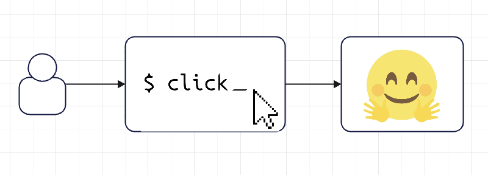
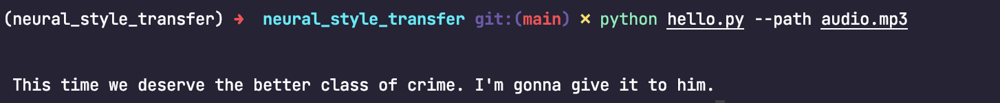

[](https://github.com/szheng3/neural_style_transfer/actions/workflows/python-app.yml)
[](https://github.com/szheng3/neural_style_transfer/actions/workflows/publish.yml)

# openai whisper cli - converts speech into text

This project aims to develop a Python command-line interface (CLI) that converts speech into text. The project utilizes a pre-trained model from the hugging-face library, which is implemented in Python, to perform the conversion.

## Project Goals/Outcomes

* Develop my python cli with openai whisper
* Use Github Codespaces and Copilot
* Integrate libtorch and 'hugging-face pretrained models' into a python cli project

## Architectural Diagram


## Demo


## Setup Manually

1. Install python
2. Install dependencies
```
make install
```


## 
* Run the cli
```
python hello.py --path audio.mp3
```

  
## Docker(Recommended)

* This repo main branch is automatically published to Dockerhub with [CI/CD](https://github.com/szheng3/neural_style_transfer/actions/workflows/publish.yml), you can pull the image from [here](https://hub.docker.com/repository/docker/szheng3/whisper-ml-cli/general)
```
docker pull szheng3/whisper-ml-cli:latest
```
* Run the docker image.
```
docker run szheng3/whisper-ml-cli:latest 'audio.mp3'
```

* With your own audio file
```
docker run -v /path/to/your/audio:/app/audio szheng3/whisper-ml-cli:latest /app/audio/audio.mp3
```


## CI/CD

Github Actions configured in .github/workflows


## GitHub releases
The binary could be downloaded from the release pages. [release](https://github.com/szheng3/neural_style_transfer/releases)


## Progress Log

- [x] Configure Github Codespaces.
- [x] Initialise python project with pretrained model from [hugging-face](https://huggingface.co/openai/whisper-large)
- [x] CI/CD with Github Actions
- [x] Tag and Releases

## References


* [click](https://github.com/pallets/click)